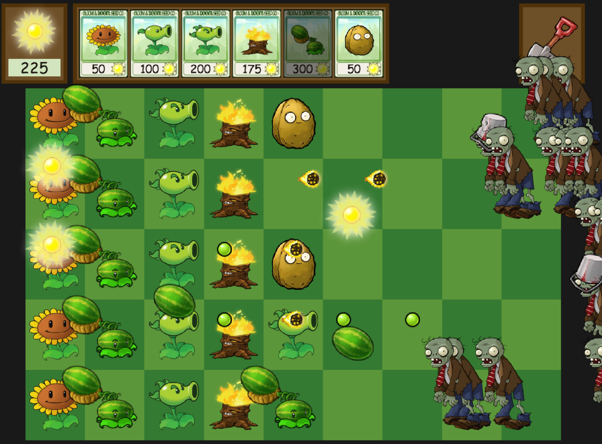

# PVZ-Remake

A personal project that reimagines the original *Plants vs. Zombies* (2009)
entirely from scratch — no external engines, no third-party runtime libraries,
and no hardware acceleration. Everything, from the rendering pipeline to the
asset system, is implemented using raw Win32 API calls and a fully custom
software renderer.



## Project Overview

This project was built as an exploration of low-level game engine architecture, software rendering, and runtime systems — with the explicit goal of understanding every moving part in a real-time 2D game.

Modern engines such as Unreal, Unity, or Godot are excellent for large-scale production, but they come with heavy abstraction layers and a runtime footprint that is often unnecessary for smaller indie games.
By writing everything from scratch, this project demonstrates that a small, tailored engine can achieve:
* Better performance and cache behavior
* Total control over the rendering and threading model
* Simpler, more readable, and more maintainable code

**Core Philosophy:** Keep code simple. Avoid abstractions that don’t provide measurable benefits in performance or maintainability.

## Build System

The build system is intentionally minimal — two batch scripts that directly invoke the MSVC compiler and linker. There are no project files, generators, or third-party dependencies involved.

#### How to Build

You can build the game using one of two methods:

1. ***Option A*** — Developer Command Prompt

Open the *Developer Command Prompt for Visual Studio* and run:
```bash
windows_build.bat
```

2. ***Option B*** — Regular Command Prompt
Open a *regular Command prompt* and run (you may need to edit *windows_shell.bat*
so the Visual Studio base path matches your local installation.):
```bash
windows_shell.bat
```

Then execute:

```bash
windows_build.bat
```

#### Build Configurations

Inside windows_build.bat, you can choose between Debug and Release builds:
1. ***/Od*** — build a debug configuration (no optimization, includes symbols)
2. ***/Ox*** — build an optimized release configuration

This one-command build pipeline keeps iteration fast and reproducible, while exposing every compiler and linker flag explicitly.

## Architecture Overview

### Platform Layer
The platform layer forms the backbone of the engine, responsible for:
* Window management and raw input (Win32 API)
* Timing and high-resolution performance counters
* Multithreading primitives and synchronization
* File I/O and virtual memory management

At its core lies an **asynchronous task queue**, enabling the engine’s
multithreaded execution model.
Each task carries its own local state, but the engine systems are structured
such that no shared-state synchronization is ever required.
This design allows parallel execution without locks or atomics, relying instead
on *data ownership* and *independent task execution*.

The result is a predictable, scalable threading model — **simple**, yet powerful.

### Renderer

The renderer is a completely custom software rasterizer operating entirely on the ***CPU***. It uses axis-aligned quads as its only primitive, which greatly simplifies rasterization logic.

Key properties:
* The screen is divided into ***clusters***, each processed in parallel via the
platform task queue.
* The pipeline is highly ***deterministic***, with minimal branching.
* No ***reliance*** on GPU APIs like Direct3D, OpenGL, or Vulkan — by design.
* For a 2D game of this scope, the CPU is more than sufficient to handle rendering while offering full ***transparency*** into how each pixel is produced.

### Asset System

All assets (*textures*, *fonts*, etc.) are packed into a single file using an *internal* asset pack tool, the only component in the project that uses external dependencies — *stb_image* and *stb_truetype*.

Runtime asset loading is straightforward:
* Assets are loaded **on demand** when requested by the gameplay layer.
* The asset packer preprocesses everything into an **engine-native format**, eliminating runtime decoding or conversion.
* The game directly reads raw bytes from the packed file, ensuring **minimal I/O overhead**.

This approach removes the need for complex asset pipelines and guarantees consistent load performance across all platforms.

### Memory Management

After the platform layer invokes Game_Initialize(), no dynamic memory allocations occur anywhere in the runtime.

All allocations are handled via linear arenas (also known as bump allocators):
* Memory is reserved in large contiguous blocks.
* Allocation is a single pointer increment — no *free*, no *fragmentation*, no *overhead*.
* Deallocation is implicit when the arena is reset or the game shuts down.

This design provides:
* Predictable performance
* Simple, transparent allocation patterns
* Zero runtime allocation failures
* Stable behavior across all builds and platforms

The result is a deterministic, allocation-free main loop that runs with complete consistency frame-to-frame.

### Game Layer

The gameplay code is rooted in two functions called by the platform layer:
* **Game_Initialize()** — performs all one-time setup.

* **Game_UpdateAndRender()** — executed once per frame to update and render the
entire game state.

Each subsystem (garden grid, plant selector, sun counter, shovel, etc.) is
implemented in a separate .inl file and directly included into pvz.cpp.
Every subsystem defines three consistent functions:
* **\*_Initialize()**
* **\*_Update()**
* **\*_Render()**

This layout avoids unnecessary header/include *complexity* while keeping the code **modular**, **easy to follow**, and **efficient to compile**.

## Summary

PVZ Remake is both a ***game*** and a compact, ***purpose-built engine***.
It demonstrates that with a clear understanding of system design, threading, and rendering fundamentals, it’s possible to build a complete, performant, and maintainable game runtime without any external engine.

This project emphasizes:
* Direct use of Win32 for system-level control
* A **multi-threaded software renderer** built around clustered workloads
* Independent **task-based multithreading** with no synchronization overhead
* Static, allocation-free memory architecture using **linear arenas**
* **Simple and transparent** build and runtime systems

In a landscape where general-purpose engines often overcomplicate small projects, PVZ-Remake proves that clarity, simplicity, and control remain the most powerful development tools.
